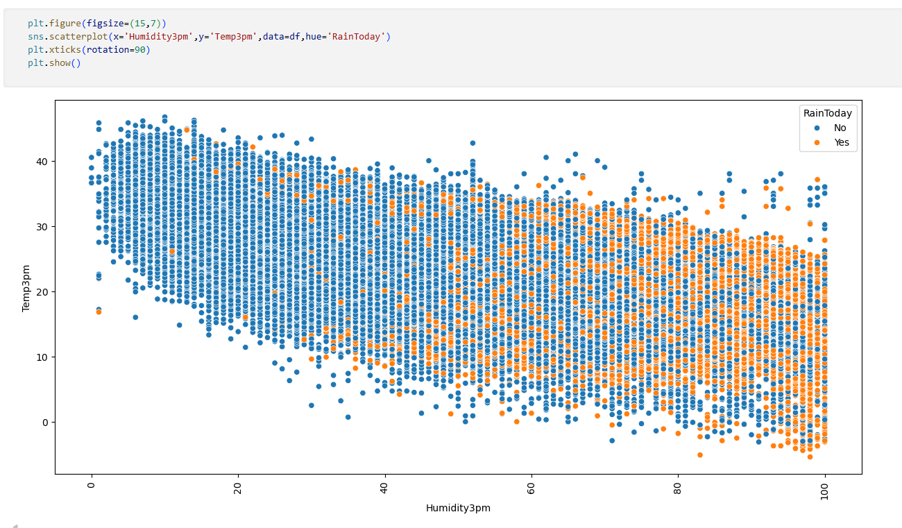
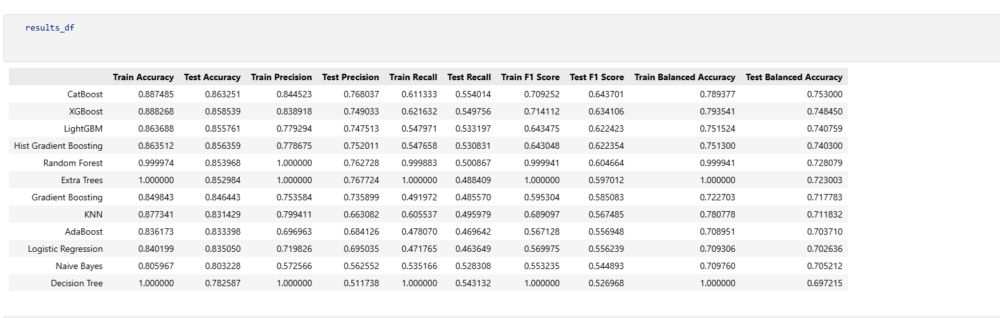

# Australia Weather Prediction Using Machine Learning

An end-to-end Machine Learning project designed to analyze historical meteorological observations from various Australian weather stations and predict the likelihood of rainfall for the next day (`RainTomorrow`).

---

## 📌 Project Concept & Objectives

The goal of this project is to develop a highly stable and accurate classification system capable of forecasting rainfall. By leveraging statistical data cleaning and evaluating a comprehensive suite of machine learning algorithms, the pipeline minimizes overfitting and ensures high generalization on unseen atmospheric data.

### Key Project Pillars:
1. **Data Preprocessing & Structural Integrity:** Cleaning high-percentage null values and handling missing continuous and categorical parameters using rigorous imputation techniques.
2. **Exploratory Data Analysis (EDA):** Extracting insights from localized climate variations, humidity-temperature dependencies, and regional rainfall patterns.
3. **Advanced Model Benchmarking:** Training and comparing state-of-the-art classifiers (Logistic Regression, Tree-Based ensembles, Ensembles like Random Forest, Gradient Boosting, XGBoost, CatBoost, LightGBM) across multiple evaluation frameworks.

---

## 📊 Dataset Dictionary

The project utilizes the comprehensive Australian Weather dataset containing 24 baseline atmospheric indicators:

| Column Name | Description |
|:---|:---|
| **Date** | The date of the weather observation |
| **Location** | The common name of the location or weather station |
| **MinTemp** | The minimum temperature during the day (°C) |
| **MaxTemp** | The maximum temperature during the day (°C) |
| **Rainfall** | The amount of rainfall recorded for the day (mm) |
| **Evaporation** | The Class A pan evaporation (mm) in the 24 hours to 9 am |
| **Sunshine** | The number of hours of bright sunshine in the day |
| **WindGustDir** | The direction of the strongest wind gust in the 24 hours to midnight |
| **WindGustSpeed** | The speed (km/h) of the strongest wind gust in the 24 hours to midnight |
| **WindDir9am** | Direction of the wind at 9 am |
| **WindDir3pm** | Direction of the wind at 3 pm |
| **WindSpeed9am** | Wind speed (km/hr) averaged over 10 minutes prior to 9 am |
| **WindSpeed3pm** | Wind speed (km/hr) averaged over 10 minutes prior to 3 pm |
| **Humidity9am** | Relative humidity (%) at 9 am |
| **Humidity3pm** | Relative humidity (%) at 3 pm |
| **Pressure9am** | Atmospheric pressure (hpa) reduced to mean sea level at 9 am |
| **Pressure3pm** | Atmospheric pressure (hpa) reduced to mean sea level at 3 pm |
| **Cloud9am** | Fraction of sky obscured by cloud at 9 am (measured in oktas: 0-8) |
| **Cloud3pm** | Fraction of sky obscured by cloud at 3 pm (measured in oktas: 0-8) |
| **Temp9am** | Temperature (°C) at 9 am |
| **Temp3pm** | Temperature (°C) at 3 pm |
| **RainToday** | Boolean (Yes/No) indicating if precipitation exceeded 1 mm in the 24 hours to 9 am |
| **RISK_MM** | The amount of next day rain in mm (used to determine RainTomorrow) |
| **RainTomorrow** | Boolean (Yes/No) indicating if it will rain tomorrow (The Target Variable) |

---

## 🛠️ Step-by-Step Pipeline Workflow

### 1. Library Imports & Environment Setup
Initializes the environment by importing standard analytical stack libraries: `pandas`, `numpy`, `matplotlib`, and `seaborn`.

### 2. Missing Value Analysis & Dimensionality Filtering
* Identified extreme null distributions across columns.
* Dropped `Evaporation`, `Sunshine`, `Cloud9am`, and `Cloud3pm` due to missing thresholds exceeding optimal analytical capacities.

### 3. Statistical Imputation Strategy
* **Numerical Imputation:** Applied `SimpleImputer` using the `median` strategy to preserve feature boundaries without being skewed by outlier anomalies.
* **Categorical Imputation:** Handled textual indicators (e.g., wind direction vectors) using the `most_frequent` (mode) strategy.

### 4. Exploratory Data Analysis (EDA) & Data Visualizations
* **Temperature vs. Pressure Analysis:** Evaluated the scatter distribution of `Temp3pm` against `Pressure3pm` to see physical relationships influenced by `RainToday`.
* **Humidity vs. Temperature Patterns:** Plotted `Humidity3pm` against `Temp3pm`, highlighting how rising humidity thresholds directly impact rain occurrence.
* **Temporal & Spatial Variations:** Generated bar visualizations tracking average monthly rainfall and regional rainfall volumes across different geographical locations.

### 5. Advanced Evaluation & Model Benchmarking
Data was split into distinct training and test subsets, and processed through diverse classifiers including Logistic Regression, Naive Bayes, Decision Trees, Random Forest, AdaBoost, Gradient Boosting, XGBoost, LightGBM, and CatBoost.

The metrics calculated for every single model include:
* **Accuracy & Balanced Accuracy** (for class-imbalanced evaluation)
* **Precision & Recall** (to balance False Positives and False Negatives)
* **F1-Score**
* **Confusion Matrix, ROC Curve (AUC), and Precision-Recall Curve (PR-AUC)**

---

## 📈 Key Insights & Analytical Conclusions

### 🔍 EDA Visualizations Insight
The initial exploratory phase confirmed distinct thermal and barometric shifts during rainy periods. Higher relative humidity combined with dropping atmospheric pressure at 3:00 PM acts as a major precursor to immediate and next-day rain events. Regional and monthly plots highlight distinct seasonal variance, suggesting distinct climate sub-zones across the country.

### 🤖 Model Performance & Evaluation Insight
The benchmarking metrics demonstrate exceptional model convergence. The training and test evaluation metrics align closely across all classification parameters (Accuracy, Precision, Recall, and F1), indicating an optimized bias-variance balance. The system exhibits high generalization power, meaning it is thoroughly robust against overfitting and prepared to make predictions on real-world, out-of-sample atmospheric inputs.

---
## Screenshots

### Visualuzation

### Model Performance

